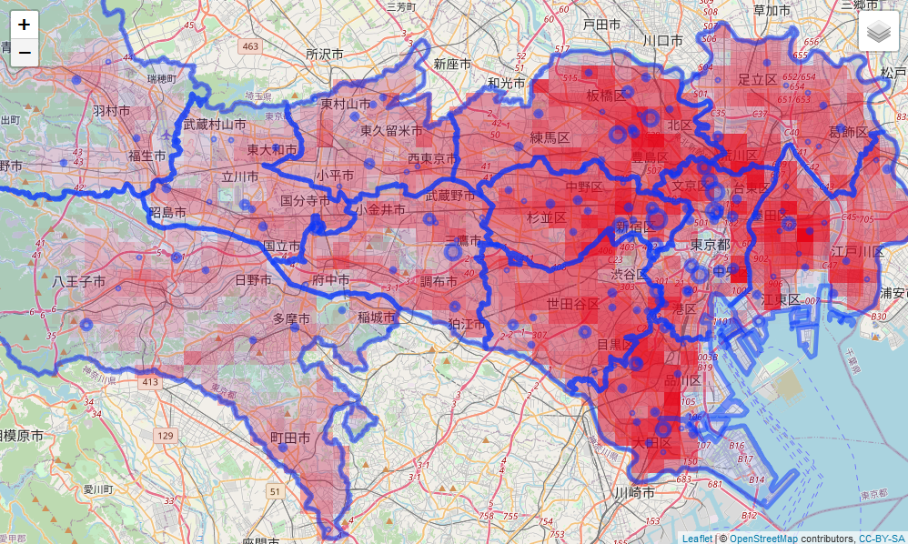
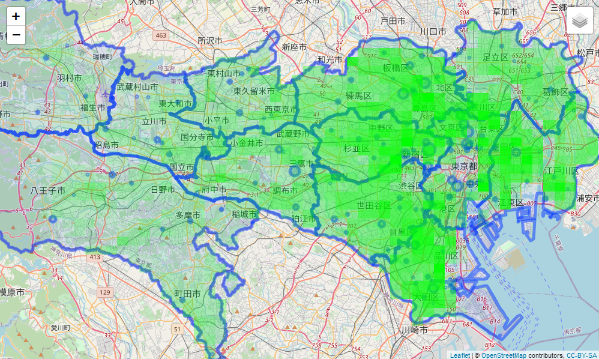
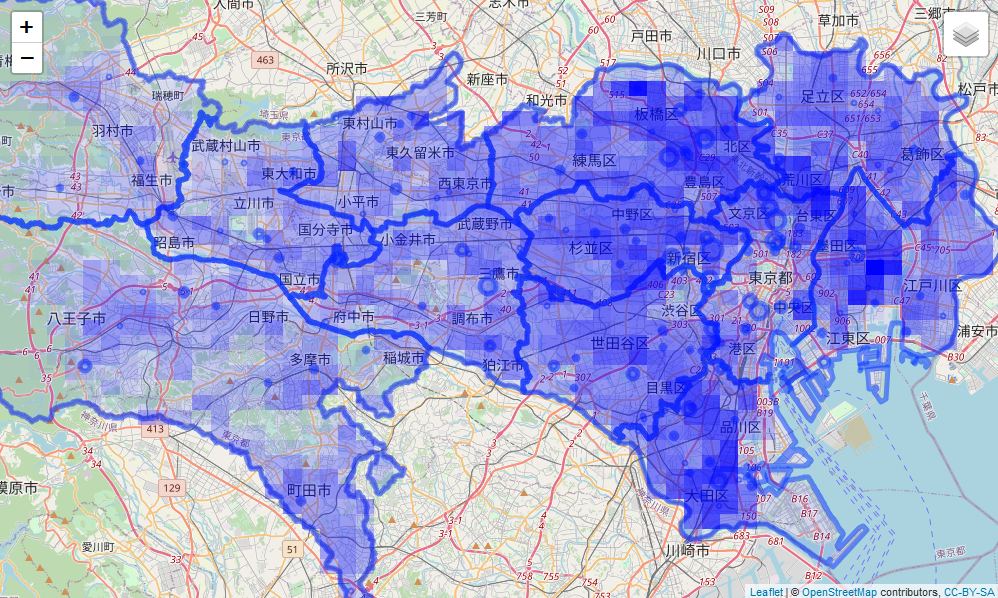
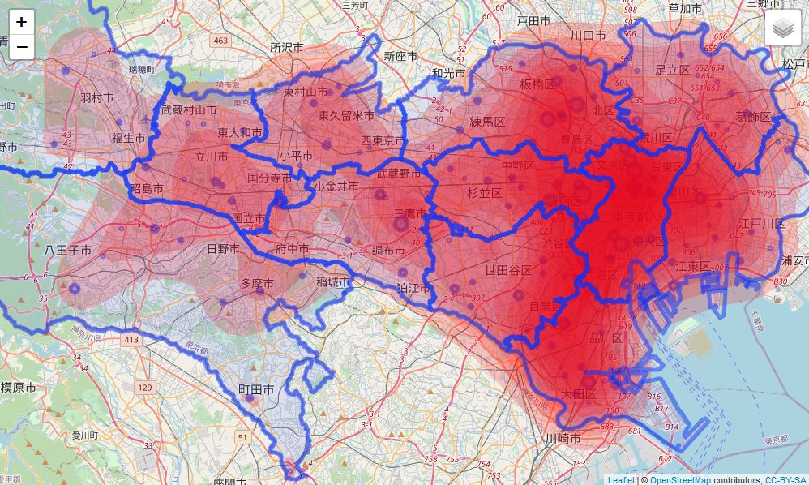

# 人口メッシュデータとDPC病院データをマッシュアップ

## データ
- [1kmメッシュ別将来推計人口データ（H30国政局推計）（shape形式版）](https://nlftp.mlit.go.jp/ksj/gml/datalist/KsjTmplt-mesh1000h30.html)
	- 人口メッシュデータの変数名および変数の格納値は以下を参照
		- [公表用データファイルのデータ項目](https://nlftp.mlit.go.jp/ksj/gml/datalist/mesh500_1000_h30_datalist.pdf)
	- shapeファイルをGoeJsonに変換する、こうすることでleafletで簡単に読み込めるようになるはず
		- [Convert SHP to GeoJSON Online](https://mygeodata.cloud/converter/shp-to-geojson) 有料
		- [mapshaper](https://mapshaper.org/)　無料？
- [DPC導入の影響評価に関する調査：集計結果](https://www.mhlw.go.jp/stf/seisakunitsuite/bunya/0000049343.html)
	- [令和元年度DPC導入の影響評価に係る調査「退院患者調査」の結果報告について](https://www.mhlw.go.jp/stf/shingi2/0000196043_00004.html)
		- [施設概要表（Excel：560KB）](https://www.mhlw.go.jp/content/12404000/000758182.xlsx)
	- 表示しているのはDPC算定病院のみ、準備病院は含めていない
- [国土数値情報ダウンロード 医療圏データ](https://nlftp.mlit.go.jp/ksj/gml/datalist/KsjTmplt-A38.html)
	- これもshape fileなのでいったんGeoJsonに変換してから読み込む
	- ただし、島しょ部の部分が巨大になるため、削除している

## データの出典
- [「国土数値情報（1kmメッシュ別将来推計人口データ（H30国政局推計））」（国土交通省）](https://nlftp.mlit.go.jp/ksj/gml/datalist/KsjTmplt-mesh1000h30.html)を加工して作成
- [令和元年度DPC導入の影響評価に係る調査「退院患者調査」の結果報告について（厚生労働省）](https://www.mhlw.go.jp/stf/shingi2/0000196043_00004.html)を加工して作成
- [「国土数値情報（医療圏データ）」（国土交通省）](https://nlftp.mlit.go.jp/ksj/gml/datalist/KsjTmplt-A38.html)を加工して作成

## ジオコーディング
- 過去の経験から、GoogleMap APIでもランドマーク名によるジオコーディングはあまり精度が良くない
- DPC病院のデータは病院名しかないため、素直にやろうとするとランドマーク名によるジオコーディングになってしまう
- できれば病院名から住所を探し、その住所からジオコーディングするのが精度的には望ましい
- [CSVアドレスマッチングサービス](https://newspat.csis.u-tokyo.ac.jp/geocode-cgi/geocode.cgi?action=start)

## 使い方
1. mushup_DPC.Rを実行し、必要なデータを作成
1. mushup_DPC_leaflet.Rを実行し、地図を表示
1. あとはお好きにどうぞ
- データの読み込みパスは事前に修正してください

## 画像

## reference
- [LONDON.r](https://rpubs.com/freakonometrics/69270)
- [bkde2D: Compute a 2D Binned Kernel Density Estimate](https://www.rdocumentation.org/packages/KernSmooth/versions/2.23-18/topics/bkde2D)
- [Adding Multiple Polygons via Loop in R Shiny Map Using Leaflet](http://blog.isharadata.com/2017/03/adding-multiple-polygons-via-loop-in-r.html)
- [Show/Hide Layers](https://rstudio.github.io/leaflet/showhide.html)
